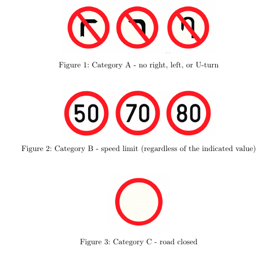
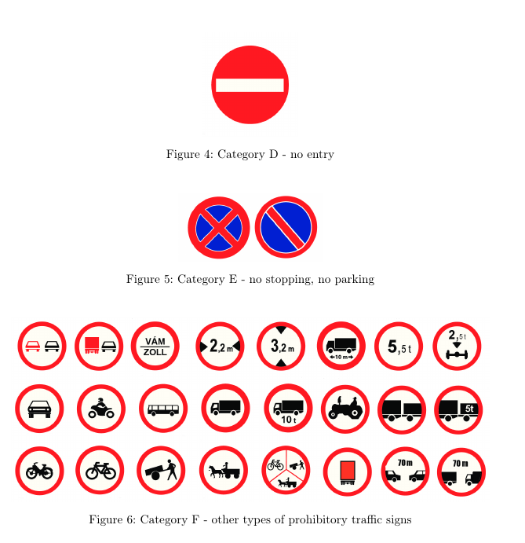

# AI-in-Data-Science-Data-Challenge
Solution to the Data Challenge task. Authors are Izabell Járó, Kristóf Benedek, and Marcell Emmer.

Computer vision is one of the most promising fields of data science since it has a wide
range of applications including self-driving cars, medical image analysis, and facial recognition. 
The Data Challenge aims to provide hands-on experience in digital image
processing.

Our task is to build an algorithm for prohibitory traffic sign recognition. Some of the possible ways of getting images:

* It is possible to simply take screenshots of the desired images (e.g. Google Street View
or other online sources).
* You can use the google-streetview [Python module](https://pypi.org/project/google-
streetview/) for downloading Google Street View images with a Python script. Details
about the usage of Google Street View API can be found in the [official documentation](https://developers.google.com/maps/documentation/streetview/intro).
* Use some already existing datasets, augment it, label it, etc 

There are 6 traffic sign categories your model should be able to recognize:




There are multiple possibilities to tackle this problem. Just to name a few: pattern recognition with image segmentation, CNN, using pre-trained models, etc.

Our group chose to use a pre-trained ANN model. We worked in python mainly using keras, numpy, cv2 and some tensorflow.

You can reach the database for the simple categorizer [here](https://mega.nz/file/f4NAiLZB#R0Vc3rMhoSbKgriiHR8JuLknETP5korDcycJDSvLTvU). The YOLOv8 dataset was trained with that data available [here](https://mega.nz/file/LxF3SDSJ#SOqRufIMTeESzGdEG3-OZjDWekIwzLD1GyGw10N3m9E) (be aware this file is quite large, ~16 Gb!). The data for the "simple" categorizer contains 6 different classes of prohibitory traffic signs. It was compiled from the [GTSRB](https://benchmark.ini.rub.de/gtsrb_news.html) and [TSRD](http://www.nlpr.ia.ac.cn/pal/trafficdata/recognition.html) databases. It is already split into a training and testing dataset. Preprocessing and data augmentation are needed, these are just the raw source files. The data for the YOLOv8 ANN was created from the open access data from [Mapillary](https://www.mapillary.com/dataset/trafficsign). It has at the core over 40 000 images for training and validation and over 10 000 for testing with over 400 categories. The original images were compressed and converted to lossy ```.jpg``` format from lossless ```.png```, to obtain a smaller-sized dataset, but the resolution was kept.

The resulting categorizer's CNN can be found [here](https://mega.nz/file/OpFTzCxD#5v2uDk7mn2MLkgAfvT8oP3WtAI00p4oKIdp0jP7EQIU). The GUI for the classification was inspired by [this blog post](https://www.analyticsvidhya.com/blog/2021/12/traffic-signs-recognition-using-cnn-and-keras-in-python/)

**TODO**
- [x] categorize the dataset for YOLO and pick only the objects needed for our task (i.e. mostly the prohibitory ones)
- [x] re-split/augment the data for YOLO
- [x] augment the data for the simple categorizer
- [x] create the categorizer
- [x] Write a GUI for the categorizer
- [ ] train the YOLOv8
